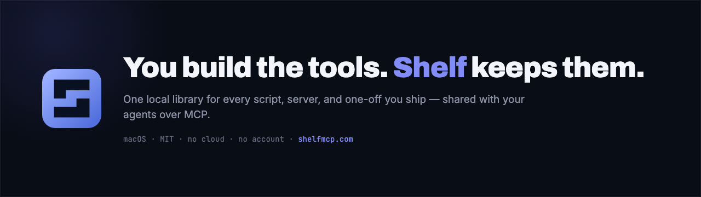

<div align="center">



# Shelf

**You build the tools. Shelf keeps them.**

A local library for the scripts, dev servers, and one-offs you write for yourself — with remembered
launch commands, live status, and logs. Plus a bundled MCP server, so Claude, Cursor, and Codex can
query what you've built, launch it, and honestly record what's missing.

[**Download for macOS**](https://shelfmcp.com/download) · [shelfmcp.com](https://shelfmcp.com) · MIT · No account

</div>

---

<!-- TODO: record shelf-demo.gif (shot list in the copy pack), then restore:

-->


## What it does

- **One click, no ritual.** Point Shelf at a project folder. It scans for scripts, ports, package
  manager, and `DESIGN.md`, and suggests a launch config. Accept it and the tool lives in your library.
- **Status that doesn't lie.** Port-backed tools never report Running until TCP readiness actually
  succeeds. Live logs, Stop, Restart.
- **Agents can see your shelf.** A local stdio MCP server exposes your library — list tools, check
  readiness, launch, stop, read logs.
- **Capability gaps, recorded.** When nothing in your library matches what an agent was asked to do,
  Shelf writes it down instead of improvising. Plans, not silent failures.
- **Your brand, in every agent.** Design profiles hold your colors, type, voice, and logo assets —
  edited with a live preview, served over MCP. Say "build it with my branding" in any connected
  agent and it pulls your tokens and a paste-ready brand brief. Show an agent a site you love and
  it can save the extracted brand back as a draft you review.
- **Quick Open** (`⌘K`), menu bar mode, and a `shelf://` URL scheme.

## Install

Download the signed, notarized DMG:

**[shelfmcp.com/download](https://shelfmcp.com/download)**

Open it, drag Shelf into Applications, launch from Spotlight. Shelf auto-updates itself from GitHub
releases.

Requires **macOS on Apple Silicon** (M1 or later). No Intel build. No account, no subscription.

## Use

1. Click **Add tool** (or press `⌘N`).
2. Choose a project folder — Shelf suggests launch command, port, tags, and `DESIGN.md` when it can.
3. Open the tool and click **Launch** — or use **Quick Open** (`⌘K`) to jump to a tool and `⌘↵` to
   launch/stop.
4. Watch status and live logs; use **Stop** / **Restart** as needed.
5. Open URL, folder, editor (Cursor/VS Code), or Terminal from the detail view.

### Menu bar & `shelf://`

Shelf can sit in the menu bar (Settings → Menu bar). Global show/hide defaults to `⌘⇧Space`.

```bash
open 'shelf://open'
open 'shelf://quick-open'
open 'shelf://tools/<id>/launch'
open 'shelf://launch?name=Photo%20Prepper'
```

Action links (`launch`, `stop`, `restart`) require confirmation in Shelf, so a web page or another
application cannot control local tools silently.

## MCP — giving agents your shelf

**Easiest path:** open Shelf → **MCP Connections** → Connect Claude, Cursor, or Codex. Shelf writes
the client MCP config for you (Claude: quit and reopen; Cursor: reload MCP; Codex: restart / new CLI
session), then ask *"List my Shelf tools."*

Shelf exposes a local stdio MCP server that reads and writes the **same** library as the GUI, and can
launch and stop tools. The packaged app ships a standalone bundle at
`Shelf.app/Contents/Resources/mcp/`.

Manual config (prefer the path shown in **MCP Connect** inside Shelf):

```json
{
  "mcpServers": {
    "shelf": {
      "command": "node",
      "args": [
        "/Applications/Shelf.app/Contents/Resources/mcp/mcp/server.js"
      ]
    }
  }
}
```

**Capability intelligence is descriptive and local.** Agents can discover declared interfaces and
record missing capabilities, but Shelf does not connect to or invoke child MCP servers. It exposes
your tools, and that's the whole scope.

Example prompts:

> "What Shelf tool can batch optimize images?"
>
> "If nothing can fill PDF forms, record that capability gap and explain why."

<details>
<summary><strong>All MCP tools</strong></summary>

`shelf_list_tools`, `shelf_get_tool`, `shelf_find_capability`, `shelf_check_tool_readiness`,
`shelf_record_capability_gap`, `shelf_list_capability_gaps`, `shelf_get_gap_brief`,
`shelf_update_capability_gap`, `shelf_find_free_port`, `shelf_inspect_project`,
`shelf_register_project`, `shelf_upsert_tool`, `shelf_remove_tool`, `shelf_launch_tool`,
`shelf_stop_tool`, `shelf_get_status`, `shelf_get_logs`, `shelf_list_receipts`,
`shelf_clear_receipts`, `shelf_list_collections`, `shelf_get_design_md`,
`shelf_list_design_profiles`, `shelf_get_design_profile`, `shelf_upsert_design_profile`.

Resources: `shelf://tools/{id}/design-md`, `shelf://design/profiles/{id}`.

</details>

Project skill for agents: [`.cursor/skills/shelf-register/SKILL.md`](.cursor/skills/shelf-register/SKILL.md).

## Where your data lives

Everything Shelf knows is plain JSON in one folder you can read, back up, or delete:

```
~/Library/Application Support/Shelf/
├── library.json           your tools
├── capability-gaps.json   what agents needed and couldn't find
└── receipts.json          what launched, when
```

**No account. No cloud sync. No telemetry.**

Shelf makes exactly one outbound network request, once per install: a first-launch onboarding survey.
The payload is your survey answers (what you shelved first, your role, how you heard about Shelf,
which agents you use), an optional name and email you can skip, plus app version and platform. No tool
names, no file paths, nothing recurring. The endpoint is
[`site/src/app/api/onboarding/route.ts`](site/src/app/api/onboarding/route.ts) if you'd rather read it
than take our word for it.

MCP responses mask env keys matching `TOKEN|SECRET|PASSWORD|KEY`.

## Security notes

- Commands run via `/bin/zsh -lc`, so your login PATH (nvm/fnm) is available.
- Shelf launches your commands **as you**. It does not sandbox them. If you shelve something
  dangerous, Shelf will faithfully run the dangerous thing.
- Interactive prompts and `sudo` are not supported.

---

## Develop

Requires macOS and Node.js 20+.

```bash
npm install
npm run electron:dev
```

Starts the Vite renderer on `http://127.0.0.1:5173` and opens the Electron shell.

### Local desktop build

```bash
npm run install:desktop
```

Builds Shelf, packages `Shelf.app`, and copies it to `/Applications` (when permissions allow) and
Desktop. Prefer opening **Shelf** from `/Applications` — MCP Connect writes that durable path when
both copies exist. Do not launch the raw Electron binary inside `node_modules`.

First launch of an unsigned *local* build: right-click → **Open** if Gatekeeper blocks it. Released
DMGs are signed and notarized and do not need this.

### MCP server build

```bash
npm run mcp:build
```

Produces a standalone bundle at `dist-mcp/mcp/server.js` with MCP SDK deps included.

### Marketing site

The Next.js site lives in [`site/`](site/). See [`site/README.md`](site/README.md) for setup.

<details>
<summary><strong>Scripts</strong></summary>

| Command | Purpose |
|---|---|
| `npm run electron:dev` | Dev app with hot reload |
| `npm run build` | Compile shared + Electron + MCP + Vite |
| `npm run mcp` | Build and run the MCP server on stdio |
| `npm run typecheck` | TypeScript checks |
| `npm run smoke` | Shell/port readiness smoke test |
| `npm run smoke:quick-open` | Quick Open ranking helpers |
| `npm run smoke:capabilities` | Capability migration, ranking, readiness, and gap persistence |
| `npm run smoke:import` | Smart project-import inspector |
| `npm run smoke:receipts` | Run receipt store |
| `npm run smoke:receipt-export` | Receipt filter + JSON/CSV export |
| `npm run smoke:shelf-url` | `shelf://` URL parser |
| `npm run smoke:adopt` | Adopt/stop a tool launched by another ProcessManager |
| `npm run smoke:library-safety` | Corrupt-library backup and fail-closed recovery |
| `npm run smoke:claude-connect` | One-click Claude Desktop config merge |
| `npm run smoke:cursor-connect` | One-click Cursor MCP config merge |
| `npm run smoke:codex-connect` | One-click Codex `config.toml` upsert |
| `npm run smoke:mcp-path` | Prefer `/Applications` MCP path over Desktop |
| `npm run smoke:electron` | Library + ProcessManager integration smoke |
| `npm run smoke:mcp` | MCP client end-to-end smoke |
| `npm run smoke:all` | Full pre-product smoke gate |

</details>

CI runs `npm run typecheck` and `npm run smoke:all` on macOS for pushes and PRs to `main`.

## Status

v0.5.x. Early — built solo, and used seriously by roughly one person so far. Issues and blunt feedback
are welcome.

## License

MIT — see [LICENSE](LICENSE).
